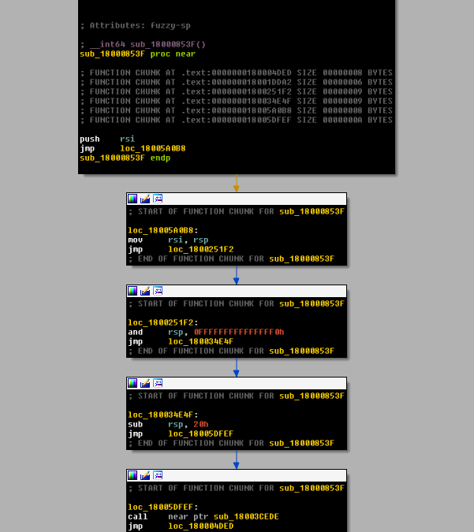
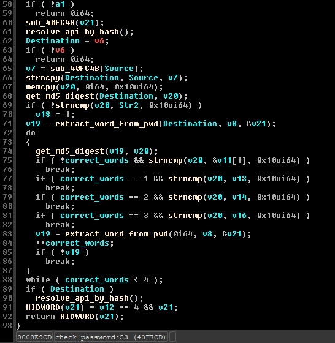

# Flare-On 10 - Challenge 13 - Control Flow Deobfuscator

### Motivation

This year's Flare-On was filled with a very interesting set of challenges and I enjoyed it very much. :-)

I managede to solve #13 by inspecting the return values of the ropchain method. Then I could get the flag byte-by-byte. However this wasn't enough as other people I talked to managed to deobfuscate the binary and see a clean decompilation using IDA (using Binja or Ghidra with the right configuration, basically deobfuscated everything automatically so no bother) so I thought that this would be a good project for learning.

## About

This repository contains a deobfuscator for challenge #13 of this year's Flare-On and is written using entirely the IDA Pro Python API.

However there are some places where the [Keystone Engine](https://www.keystone-engine.org/download/#python-module-for-windowsmacoslinux---binaries-) and the [Capstone Engine](https://www.capstone-engine.org/download.html#python-module-for-windowsmacoslinux---binaries----) were used for convenience.

## How to run it

1. Load the original binary `y0da.exe` in IDA Pro.
2. Hit `Alt + F7`.
3. Load the script `deobfuscator.py`.
4. Let the script do its thingies. :)

## Dependencies

- **Python 3**

- **Keystone Engine**

- **Capstone Engine**

Also, note that the script can be run *only* from inside IDA Pro.

To install these dependencies you can run
```bash
pip install -r requirements.txt
```
inside the folder of the project.

## Usage

Currently, the project supports a few generic features such as:

- By setting `EXPORT_OLD_DEOBFUSCATED_DISASSEMBLY_IDA_FORMATTED` to `True`, you get a nice-looking deobfuscated disassembly written to a file with IDA-like instruction format. You can choose the output file name by setting `OLD_DISASSEMBLY_FILENAME`.

- By setting `EXPORT_DEOBFUSCATED_SHELLCODE` to `True`, you get the final deobfuscated bytecode written to a file in raw-byte format. You can choose the output file name by setting `DEOBFUSCATED_SHELLCODE_FILENAME`.

- By setting `EXPORT_NEW_DEOBFUSCATED_DISASSEMBLY_CAPSTONE_FORMATTED` to `True`, you get a nice-looking deobfuscated (and relocated) disassembly written to a file with Capstone-like instruction format. You can choose the output file name by setting `NEW_DISASSEMBLY_FILENAME`.

For all the features above, you should also set the absolute path of the output files using the `PATH` variable.

The deobfuscator has also some features regarding which parts of the binary you want to deobfuscate.

- **Method 1** :: You let the tool work automatically by finding and deobfuscating all the functions that are called at least once from any location inside the binary. This is the default method.

- **Method 2** :: The tool starts deobfuscating from the Original Entry Point (OEP) of the binary.

- **Method 3** :: You can set the function from which you want the tool to start working on by setting the field `SPECIFIC_FUNCTION`.

## Technical Details

### Deobfuscator
In the following graph you can see how control flow obfuscation looks like inside the binary.

<p align="center"></p>

What the deobfuscator basically does is convert the obfuscated assembly above into the following:

```x86asm
0x18000853f : push    rsi
0x18005a0b8 : mov     rsi, rsp
0x1800251f2 : and     rsp, 0FFFFFFFFFFFFFFF0h
0x180034e4f : sub     rsp, 20h
0x18005dfef : call    near ptr sub_18003cede
...
```

Things become a little more tricky when conditional jumps and calls come into play. For that, the tool visits each of these branches recursively after hitting a return instruction in the current function. For example:

```x86asm
0x18004bf0f : pop     r15
0x18003893e : mov     [rsp+arg_870], rax
...
0x180015d8d : cmp     [rsp+0D08h+var_490], 0
0x180047db1 : jnz     loc_180006D53           ; add branch to visit later
0x180058144 : mov     eax, 0FFFFFFFFh
0x18000cd5d : add     rsp, 0D08h
0x180033b66 : retn                            ; ret found, start visiting stored branches
0x180006d53 : mov     r9d, 4                  ; start of conditional branch
0x180048e7d : mov     r8d, 1000h
0x18000f612 : mov     edx, 58h ; 'X'
```

#### Edge cases

Apart from the conditional jumps, I had to also deal with several edge cases. Some of them are the following:

- Treat instructions like `jmp rax` as a return instruction as the tool cannot resolve the value of rax dynamically.

- If a conditional jump lands on a jump instruction, I should append this jump instruction as it is an instruction-bridge.

- Avoid visiting branches that jump to places in memory.

### The goal is ... decompilation!

Of course, getting just a pretty disassembly is not enough - the goal is decompilation. You can see that the instructions are not continuous. Due to several jump instructions in the original binary it is likely that the next instruction is miles away from its previous. As a result, we cannot just dump the deobfuscated shellcode and decompile with IDA, we also have to calculate new addresses!

## Calculating new addresses

To achieve that, I stored a dictionary in which I mapped the old addresses of the original binary to new ones starting from offset `0x00`. For example, the OEP would be calculated as follows.

#### Original OEP

```x86asm
0x180032701 : sub     rsp, 28h
0x1800136a2 : call    sub_18000853F
0x1800340c9 : add     rsp, 28h
0x180016d82 : retn
```

#### New OEP

```x86asm
0x00 : sub      rsp, 0x28
0x04 : call     0xe
0x09 : add      rsp, 0x28
0x0d : ret
```

Then, the dictionary will look like:

```python
{
    0x180032701 : 0x00,
    0x1800136a2 : 0x04,
    0x1800340c9 : 0x09,
    0x180016d82 : 0x0d
}
```

However, a problem arises when the current instruction being written is a conditional jump. We will talk about it in the next section.

## Fixing jump addresses

Yay! We calculated the new addresses so that they are continuous but what about the jump addresses? The jump (or call) instructions will still attempt to jump to address of the original binary. We must adjust them too.

#### Before fix
```x86asm
0x3eda : pop    r15
0x3edc : mov    qword ptr [rsp + 0x878], rax
...
0x3ef3 : cmp    qword ptr [rsp + 0x878], 0
0x3efc : jne    loc_180006D53               ; old jump address
0x3f02 : mov    eax, 0xffffffff
0x3f07 : add    rsp, 0xd08
0x3f0e : ret    
0x3f0f : mov    r9d, 4                      ; should jump here
0x3f15 : mov    r8d, 0x1000
```

#### After fix
```x86asm
0x3eda : pop     r15
0x3edc : mov     qword ptr [rsp + 0x878], rax
...   
0x3ef3 : cmp     qword ptr [rsp + 0x878], 0
0x3efc : jne     0x3f0f
0x3efe : nop     
0x3eff : nop     
0x3f00 : nop     
0x3f01 : nop     
0x3f02 : mov     eax, 0xffffffff
0x3f07 : add     rsp, 0xd08
0x3f0e : ret     
0x3f0f : mov     r9d, 4
0x3f15 : mov     r8d, 0x1000
```

Why we used NOP bytes? In the original binary, the distance between the instructions is large (i.e. `0x180032701 => 0x1800136a2`), therefore most of the instructions for conditional jumps were usually 6 opcodes long whereas with the new addresses they're just 2 opcodes. For example:

```
jnz loc_180006D53 => 0F 85 9C EF FB FF
jne 0x3f0f        => 75 11              
```

## And ...

Finally, we can use the tool [shellcode2exe](https://github.com/repnz/shellcode2exe) to compile the deobfuscated bytecode into an .exe file. Let's open the new binary in IDA and see what it looks like.

<p align="center"></p>

It's not perfect but we can understand what it is about!

## TO-DO

- To mark this project as finished, I want to create a new segment to the original binary and inject the deobfuscated bytecode there, then patch the main function to jump to my section and let it run. This will teach me a lot about PE format internals.